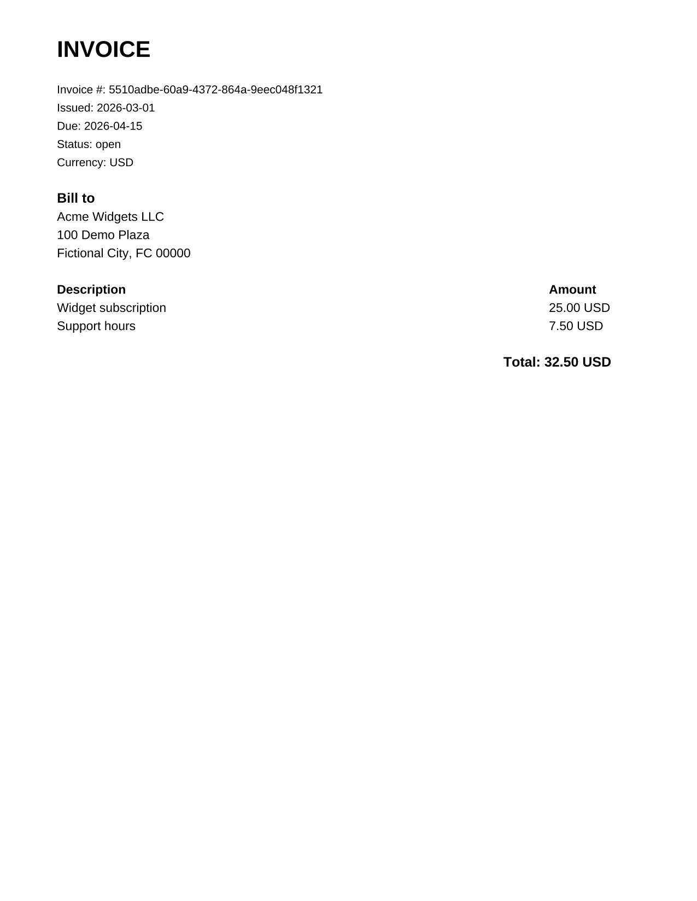
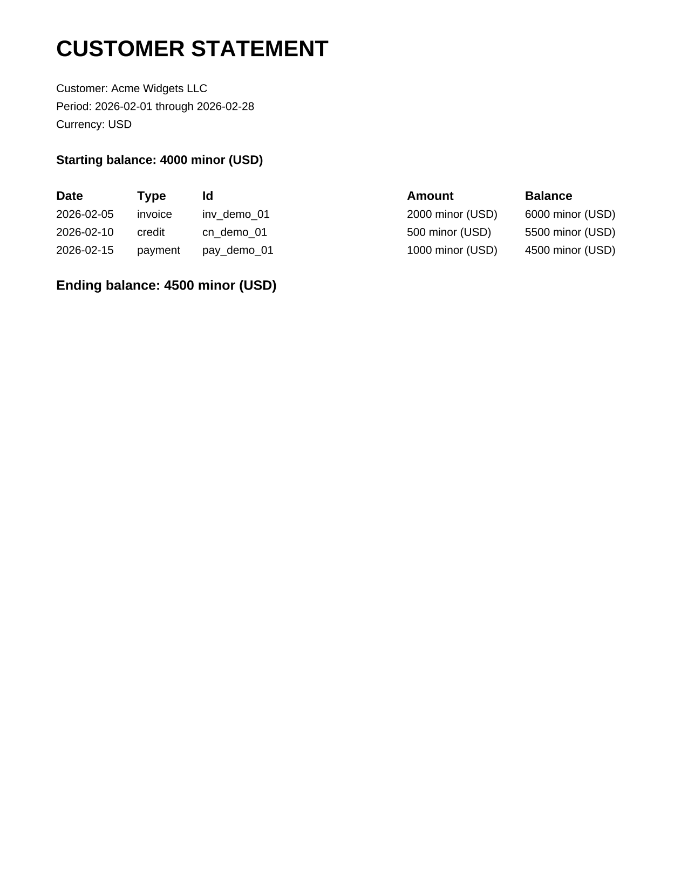

# hookledger

Personal portfolio project: a small **Java 21 / Spring Boot 3** service that ingests signed finance webhooks, stores each money event once in **PostgreSQL**, and exposes a minimal ledger API plus a simple HTML list of stored events.

## What it does

- Verifies an **HMAC-SHA256** signature over the **raw** webhook body before JSON is parsed.
- Accepts money events of type `charge`, `refund`, or `payout` with `amount` in **minor units** and a 3-letter **ISO currency** code.
- Refunds reference a charge (`chargeId`); payouts reference the charges they settle (`chargeIds`).
- Persists events by id (duplicate ids do not create a second row).
- **Double-entry:** each stored event has a **debit** side (positive minor units) and a **credit** side (negative minor units) in the same currency; the two must **sum to zero**. Webhooks may send `debitMinor` and `creditMinor` explicitly; otherwise they are derived from the event type and `amount`. An unbalanced pair is rejected with HTTP 400.
- REST: ingest webhook, list events, get one event by id, per-currency balance, replay an event by id, settlement graph walk, and ledger utilities below.
- [Spring Boot Actuator](https://docs.spring.io/spring-boot/reference/actuator/index.html) health at `/actuator/health`.
- OpenAPI 3 description at `/openapi/v3/api-docs` (Swagger UI at `/openapi/swagger-ui.html`).

## Run locally

Requirements: Java 21, Maven, PostgreSQL.

```bash
export SPRING_DATASOURCE_URL=jdbc:postgresql://localhost:5432/hookledger
export SPRING_DATASOURCE_USERNAME=hookledger
export SPRING_DATASOURCE_PASSWORD=hookledger
export HOOKLEDGER_WEBHOOK_SECRET='<your signing secret>'
mvn spring-boot:run
```

Create the database and role in Postgres before starting. Set `HOOKLEDGER_WEBHOOK_SECRET` to a value you generate; the application reads the signing secret **only** from this environment variable (not from config files or the repository).

Each webhook event `id` is stored at most once: resubmitting the same id returns the existing row and does not insert a duplicate.

Browse stored events at `http://localhost:8080/`.

## Webhook signature

| Item | Value |
|------|--------|
| Header | `X-Hookledger-Signature` |
| Algorithm | HMAC-SHA256 |
| Key | UTF-8 bytes of `HOOKLEDGER_WEBHOOK_SECRET` |
| Message | Raw HTTP request body bytes (exactly as received) |
| Header value | Lowercase **hex** encoding of the 32-byte digest (no `sha256=` prefix) |

Example (replace the secret with your own value from the environment):

```bash
BODY='{"id":"evt_001","type":"charge","amount":1500,"currency":"usd"}'
SIG=$(printf '%s' "$BODY" | openssl dgst -sha256 -hmac "$HOOKLEDGER_WEBHOOK_SECRET" | awk '{print $2}')
curl -sS -X POST http://localhost:8080/api/webhooks \
  -H 'Content-Type: application/json' \
  -H "X-Hookledger-Signature: $SIG" \
  -d "$BODY"
```

### API

| Method | Path | Description |
|--------|------|-------------|
| `POST` | `/api/webhooks` | Ingest signed webhook (201 created, 200 if id already exists) |
| `GET` | `/api/events` | List events (JSON, paginated: `page`, `size`; optional filters `type`, `currency`) |
| `GET` | `/api/events/{id}` | Get one stored event by id (404 if unknown) |
| `GET` | `/api/events/by-timestamp?at=` | Get one event by exact `receivedAt` (ISO-8601) |
| `POST` | `/api/events/{id}/reverse` | Void a posted event with a new opposite entry (`{id}_reversal`); original row stays |
| `POST` | `/api/period-close?through=` | Lock the ledger through an inclusive instant (ISO-8601); reject new events on or before it |
| `GET` | `/api/period-close` | Current lock (404 if none) |
| `GET` | `/api/balance/{currency}` | Balance in minor units for a 3-letter ISO currency |
| `GET` | `/api/balance/totals` | Running balance in minor units for every currency present in the ledger |
| `GET` | `/api/charges/top?limit=` | Largest charges by amount |
| `GET` | `/api/payouts/{id}/charges` | Source charges for a payout (settlement graph walk) |
| `POST` | `/api/events/{id}/replay` | Return event and increment replay count (404 if unknown); optional `Idempotency-Key` header replays at most once per key |
| `GET` | `/api/accounts/{account}/statement` | Account statement for `currency` and `from` / `to` range (minor units, balances + lines) |
| `GET` | `/api/accounts/{account}/statement.csv` | Same statement as CSV |
| `POST` | `/api/events/replay/undo` | Undo the most recent replay (404 if stack empty) |
| `GET` | `/api/trial-balance` | Per-account debits and credits in minor units (optional `currency` filter); response includes totals and whether the books still balance to zero |
| `POST` | `/api/bank-lines` | Record a bank statement line (`amountMinor`, `currency`, `date`); rows are kept after matching |
| `GET` | `/api/bank-lines/unmatched` | Bank lines not yet linked to a ledger entry |
| `POST` | `/api/bank-lines/{id}/match` | Link one bank line to one stored ledger event by id (`ledgerEventId` in JSON body) |
| `GET` | `/api/bank-lines/{id}/match-suggestion` | Suggest the oldest unmatched ledger entry with the same amount and currency (does not apply the match) |
| `POST` | `/api/bank-lines/{id}/match-greedy` | **Greedy:** link the bank line to the oldest unmatched ledger entry with the same amount and currency |
| `POST` | `/api/bank-lines/{id}/match-combination` | **Backtracking:** link the bank line to charges whose amounts sum to the line (charges stay in the ledger) |
| `POST` | `/api/payouts/{id}/split` | **Dynamic programming:** split a payout into the fewest available charges that sum to its amount |
| `GET` | `/api/events/{eventId}/audit` | Append-only audit rows for one event id |
| `POST` | `/api/fx-conversions` | Convert between currencies at a stored rate (balanced legs) |
| `POST` | `/api/invoices` | Create an invoice with customer, due date, and line items (not posted to the ledger) |
| `POST` | `/api/invoices/{id}/credits` | Apply a credit note to an unpaid invoice (reduces open balance; does not post to the ledger) |
| `POST` | `/api/invoices/{id}/payments` | Apply a partial payment and post a balanced `charge` to the ledger for that amount |
| `POST` | `/api/invoices/{id}/pay` | Mark an invoice paid and post a balanced `charge` to the ledger |
| `GET` | `/api/invoices/{id}/pdf` | Download the invoice as a PDF (`application/pdf`) |
| `GET` | `/api/invoices/aging` | Unpaid invoice aging by days past due (optional `asOf` date, default today); does not post to the ledger |
| `GET` | `/api/customers/{customer}/statement` | Customer statement for `currency` and inclusive `from` / `to` dates (minor units, read-only; does not post to the ledger) |
| `GET` | `/api/customers/{customer}/statement.pdf` | Download the customer statement as a PDF (`application/pdf`; same data as the JSON statement) |

### Invoices

Invoices are stored separately from ledger events. `POST /api/invoices` accepts `customerName`, optional `customerAddress`, `dueDate` (ISO-8601 date), `currency`, and `lineItems` (`description`, `amountMinor`). Amounts use minor units in the given currency; line items must sum to a positive total. `POST /api/invoices/{id}/credits` applies a credit note (`amountMinor`, matching `currency`) against an unpaid invoice; credits do not post to the ledger. `POST /api/invoices/{id}/payments` records a partial payment (`amountMinor`, matching `currency`) and posts a balanced charge for that amount only; the invoice stays open until the remaining balance is zero. Remaining open balance is the original line-item total minus applied credits minus payments. `POST /api/invoices/{id}/pay` creates a balanced charge (`debitMinor` positive, `creditMinor` negative, sum zero) for whatever open amount remains (a fully credited invoice with no payments is treated as settled and does not post a charge). Invoice rows are never deleted.

`GET /api/invoices/aging` returns unpaid invoices grouped by currency into aging buckets (`current`, `30`, `60`, `90`, `over90`) using **linear classification** by calendar days past due relative to optional `asOf` (ISO-8601 date, default the server’s current date). Each line shows invoice id, customer, due date, currency, and open amount in minor units (original total minus applied credits minus payments). Fully settled invoices are omitted. Responses include per-bucket totals and a grand total per currency.

`GET /api/customers/{customer}/statement?from=&to=&currency=` returns a read-only statement for one customer and currency. `{customer}` is the same identifier stored on invoices (`customerName`). Required `currency` keeps mixed currencies out of the totals. Inclusive ISO `from` and `to` dates filter each row by its activity date (invoice issue/created date, credit-note date, or payment date). The **starting balance** is invoices minus credits minus payments strictly before `from`; **ending balance** applies the same formula through `to`. Lines in the range are ordered by date and include a **running balance** (prefix sum) after each dated row. Amounts stay in minor units; nothing is posted to the ledger.

`GET /api/customers/{customer}/statement.pdf?from=&to=&currency=` returns the same statement as a PDF (`application/pdf`). Amounts in the PDF are labeled in minor units.

Sample generated invoice PDF (fictional customer):



Sample generated customer statement PDF (fictional customer):



### Bank reconciliation

Bank lines are imported from statements separately from webhook ingest. `POST /api/bank-lines` stores `amountMinor`, a 3-letter ISO `currency`, and a calendar `date` (ISO-8601). Rows are never deleted when matched.

`POST /api/bank-lines/{id}/match` links the bank line to exactly one existing ledger event. The ledger event’s **amount** (minor units) and **currency** must equal the bank line; otherwise the request is rejected with HTTP 400 and neither row is changed. After a successful match, the bank line stays in the database but no longer appears on `GET /api/bank-lines/unmatched`.

`GET /api/bank-lines/{id}/match-suggestion` runs the same **Greedy** selection as `POST .../match-greedy` but only returns the suggested ledger event id.

`POST /api/bank-lines/{id}/match-greedy` picks the oldest unmatched ledger entry (by `receivedAt`) with the same amount and currency, then links it like a manual match. Neither row is deleted.

`POST /api/bank-lines/{id}/match-combination` uses **Backtracking** to find a set of stored `charge` events in the same currency whose amounts sum to the bank line. The charges remain in the ledger; links are stored separately. If no subset works, the request is rejected with HTTP 400.

`POST /api/payouts/{id}/split` uses **Dynamic programming** to choose the fewest available `charge` events (same currency, not already used in another split or combination match) that sum to the payout amount. If no split exists, the request is rejected with HTTP 400.

### Balance

Balance for a currency is **charges minus refunds** (amounts in minor units). **Payout events are recorded but do not change the balance** — only `charge` and `refund` affect the total. Reversals net against their original event type. The running balance is exposed at `GET /api/balance/{currency}`; `GET /api/balance/totals` returns that same formula for every currency that appears in stored events.

### Reversal

`POST /api/events/{id}/reverse` creates a new stored event with id `{id}_reversal`, opposite `debitMinor` / `creditMinor`, and a link to the original. The original event is marked reversed but not deleted, so trial balance and statements still include both rows and net to zero.

### Period close

`POST /api/period-close?through=` sets an inclusive lock instant. Webhook ingest rejects events whose optional `effectiveAt` (or ingest time when omitted) is on or before that lock (HTTP 403). Reversing an event that falls inside a closed period is stamped at the first instant after the lock so nothing new is back-dated into the closed period.

### Audit trail

Append-only rows record **who** (`X-Hookledger-Actor` request header, default `system`), **when**, and **what** for webhook posts, reversals, bank-line matches, and period closes. There is no API to update or delete audit rows.

`GET /api/events/{eventId}/audit` returns audit entries for that id (for example a charge id, `{id}_reversal`, a matched ledger event id, or `period-close` for close actions).

### Processing fee on charges

A charge webhook may include optional `feeMinor` (non-negative minor units in the same currency). The original charge is stored unchanged; when `feeMinor` is positive, a second event `{chargeId}_fee` is posted with type `fee` and its own balanced debit/credit legs.

`POST /api/webhooks` with JSON such as `{"id":"c1","type":"charge","amount":1000,"currency":"usd","feeMinor":35}`.

### FX conversion

`POST /api/fx-conversions` accepts `id`, `sourceAmountMinor`, `sourceCurrency`, `targetCurrency`, and `rate` (decimal string). The service stores the rate and converted amount and posts two balanced `fx_conversion` legs (`{id}_fx_out` in the source currency and `{id}_fx_in` in the target currency).

### Trial balance

`GET /api/trial-balance` rolls up stored events into ledger accounts (`cash`, `revenue`, `payout_clearing`) per currency, using each event’s `debitMinor` and `creditMinor` legs. The response lists every account with its debit and credit totals and reports whether **total debits minus total credits** is still zero.

### Account statement

`GET /api/accounts/{account}/statement?currency=&from=&to=` returns opening and closing balances for one ledger account and currency, plus debit/credit lines for events in the range. `GET .../statement.csv` exports the same data as CSV.

### Algorithms

| Algorithm | Behavior |
|-----------|----------|
| **Binary search** | `GET /api/events/by-timestamp?at=` finds one event by exact `receivedAt` in the time-ordered list. |
| **Priority queue** | `GET /api/charges/top?limit=` returns the largest charges up to `limit`. |
| **Regex** | Webhook ingest rejects `id` and `currency` values that do not match the allowed patterns before save. |
| **Stack** | `POST /api/events/replay/undo` pops the most recent replay and restores the prior replay count. |
| **Bit flags** | Each stored event records **signed**, **replayed**, **duplicate**, and **reversed** in `stateFlags`; API responses also expose the booleans. |
| **Graph walk** | `GET /api/payouts/{id}/charges` walks from a payout to its source charges; ingest rejects settlement cycles (including a refund that references itself). |
| **Greedy** | `GET /api/bank-lines/{id}/match-suggestion` and `POST /api/bank-lines/{id}/match-greedy` pick the oldest unmatched ledger entry with the same amount and currency. |
| **Backtracking** | `POST /api/bank-lines/{id}/match-combination` finds a charge subset that sums to the bank line amount. |
| **Dynamic programming** | `POST /api/payouts/{id}/split` chooses the fewest available charges that sum to the payout amount. |
| **Math** | `GET /api/balance/{currency}` and `GET /api/balance/totals` compute the running balance (charges minus refunds); `GET /api/trial-balance` checks that total debits minus total credits is still zero (`balanced` in the JSON). |
| **Linear classification** | `GET /api/invoices/aging` buckets unpaid invoices by calendar days past due (`current`, `30`, `60`, `90`, `over90`) relative to optional `asOf`. |
| **Prefix sum** | `GET /api/customers/{customer}/statement` walks dated invoice, credit, and payment lines in order and exposes a running balance (prefix sum) after each line, with opening and closing balances for the range. |

## Tests

Integration tests use **Testcontainers** with a real PostgreSQL instance:

```bash
mvn test
```

Docker must be available to the test process.

## License

MIT — see [LICENSE](LICENSE).
